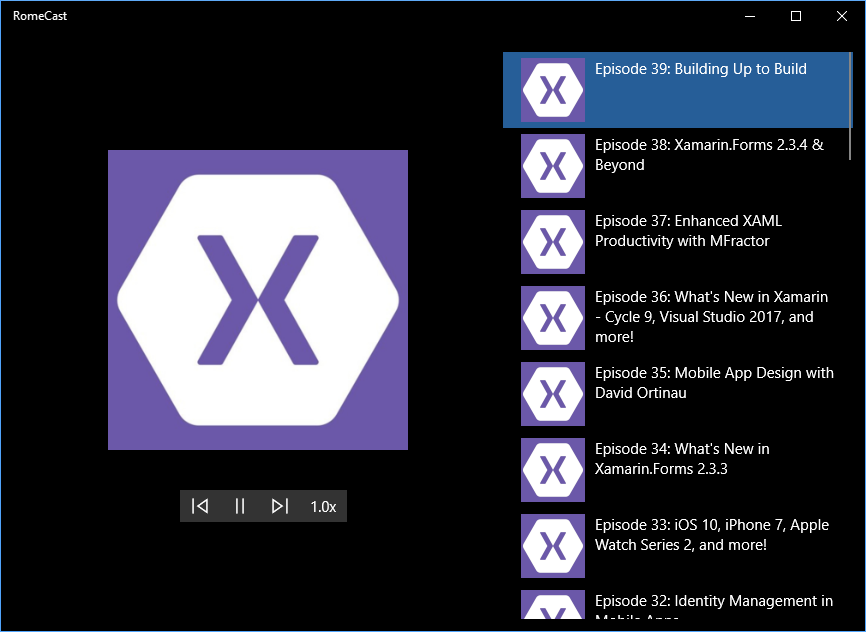
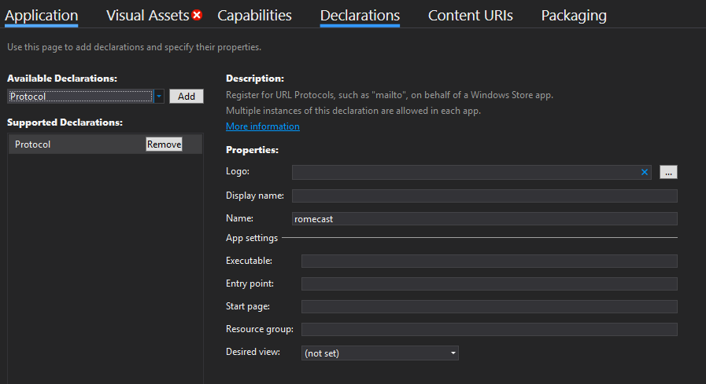
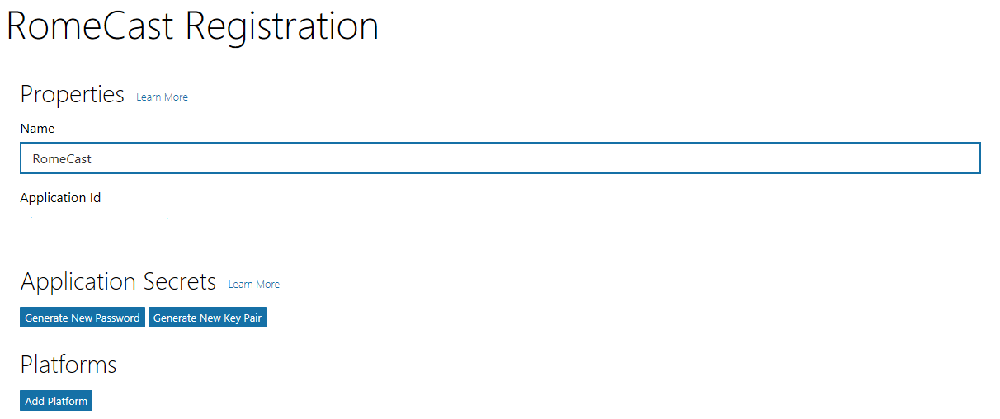
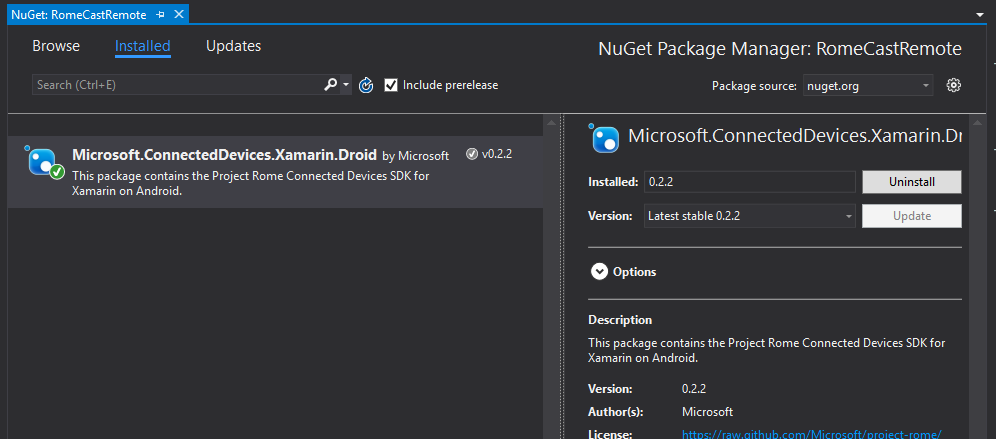
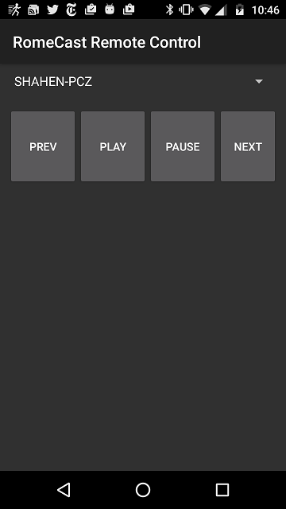

# Building a Remote Control Companion App for Android, using Xamarin and Project Rome
Building on Xamarin allows you to share code between applications that are targeting different platforms, but what if you want your apps on different platforms to talk to each other? Enter Project Rome, which allows you to build applications that span devices and platforms. In this article, you'll learn how to use Xamarin and Project Rome for Android to build a companion remote control app for a UWP media player application.

## What is Project Rome?
[Project Rome](https://github.com/Microsoft/project-rome) is a platform for creating experiences that span devices and drive up user engagement in apps. It enables developers to create human-centric features that move with the user and blur the lines between their devices, regardless of form factor or platform.

Project Rome capabilities first shipped with the Windows 10 Anniversay Update and enable developers to:
- Discover devices associated with a user's Microsoft Account or Azure Active Directory Account, using the [RemoteSystem](https://docs.microsoft.com/en-us/windows/uwp/launch-resume/discover-remote-devices) APIs
- Once discovered, use the [RemoteLauncher](https://docs.microsoft.com/en-us/windows/uwp/launch-resume/launch-a-remote-app) APIs to launch apps and URIs on the remote device
- Use [Remote App Services](https://docs.microsoft.com/en-us/windows/uwp/launch-resume/communicate-with-a-remote-app-service) to enable rich communication between apps across devices

Last month, the Project Rome Android SDK was released (complete with Xamarin .NET binding) and enabled the first two bullet points. This month's release adds the ability for Android applications to target App Services on remote Windows machines.

## The Podcast App
There many scenarios enabled by Project Rome, but one of the most compelling is building mobile companion applications for UWP applications. In this blog post, we'll build a 'remote control' companion application, but first, we need an application to control, err, remotely:

The [VideoPlayback](https://github.com/Microsoft/Windows-universal-samples/tree/master/Samples/VideoPlayback) UWP sample from the Windows SDK provides a good place to start. Other than cleaning up the UI a bit (SDK samples typically don't win any beauty contests), we added one other piece of functionality: the ability to read and parse RSS feeds of our [favorite Podcast](http://www.xamarinpodcast.com/). We'll call this app: RomeCast.



## Adding Launch URI Support
Now that we have a basic media playback application, let's make it command-able from other devices. This is easier than it might seem. First we'll declare that our RomeCast app supports being activated via a protocol. This can be done in the Package.appmanifest XML file, or using the designer, as shown below. Double-click the Package.appmanifest file to launch the designer, select the `Declarations` tab and add a `Protocol` definition. The only property that needs to be filled out, for now, is `Name`. We'll call our new protocol `romecast`.



Now we need to write some code to tell the application what to do when it's been activated via a protocol. In this case, we'll override the `OnActivated` method in `App.xaml.cs` to pass the URI on to our MainPage:

```csharp
protected override void OnActivated(IActivatedEventArgs e)
{
    LoadFrame(e);
    if (e.Kind == ActivationKind.Protocol)
    {
        var uriArgs = e as ProtocolActivatedEventArgs;
        if (uriArgs != null)
        {
            Frame rootFrame = Window.Current.Content as Frame;
            var page = rootFrame.Content as MainPage;
                        
            page?.HandleCommand(uriArgs.Uri.Query);
        }
    }
    Window.Current.Activate();
}
```

And in the MainPage, we'll parse the URI and map it to commands on the MediaPlayer object:

```csharp
internal void HandleCommand(string commandString)
{
    if (commandString != null)
    {
        switch (commandString)
        {
            //Commands
            case "play": mediaPlayer.Play(); break;
            case "pause": mediaPlayer.Pause(); break;
            case "prev": playbackList.MovePrevious(); break;
            case "next": playbackList.MoveNext(); break;
        }
    }
}
```
We can test out that everything is working, and that our app can be commanded via URIs, by opening up a web browser and trying some of the commands:

[romecast:command?play](romecast:command?play)

[romecast:command?pause](romecast:command?pause)

[romecast:command?prev](romecast:command?prev)

[romecast:command?next](romecast:command?next)


## Setting up the Android Project
Ok, we're done with the UWP project for a little while. Next we'll start on the Xamarin Android project, but first we need to generate a Microsoft Account application ID from [https://apps.dev.microsoft.com](https://apps.dev.microsoft.com). This will allow users to authenticate with their Microsoft Account and see the list of devices associated with their account.



Back over to our Xamarin Android poject, we can add the [Microsoft.ConnectedDevices.Xamarin.Droid](https://www.nuget.org/packages/Microsoft.ConnectedDevices.Xamarin.Droid/) nuget package to our project.



... and authenticate and initialize the Connected Devices platform:
```csharp
Platform.FetchAuthCode += Platform_FetchAuthCode;
var result = await Platform.InitializeAsync(this.ApplicationContext, CLIENT_ID); //CLIENT_ID from https://apps.dev.microsoft.com
```
The FetchAuthCode handler is used when the platform needs an authorization code from the user (i.e. form OAuth with Microsoft Account). See the sample for more details.
```csharp
private async void Platform_FetchAuthCode(string oauthUrl)
{
    var authCode = await AuthenticateWithOAuth(oauthUrl);
    Platform.SetAuthCode(token);
}
```

## Discovering Remote Devices

Discovering devices is straightforward, create a `RemoteSystemWatcher`, hook up the event handlers, and start disocverying devices.

```csharp
private RemoteSystemWatcher _remoteSystemWatcher;
private void DiscoverDevices()
{
    //create watcher
	_remoteSystemWatcher = RemoteSystem.CreateWatcher();

    //hook up event handlers
	_remoteSystemWatcher.RemoteSystemAdded += RemoteSystemWatcherOnRemoteSystemAdded;
	_remoteSystemWatcher.RemoteSystemRemoved += RemoteSystemWatcher_RemoteSystemRemoved;
	_remoteSystemWatcher.RemoteSystemUpdated += RemoteSystemWatcher_RemoteSystemUpdated;

    //start watcher
	_remoteSystemWatcher.Start();
}
```

## RemoteLaunchUri
Finally, we can connect and launch URIs using LaunchUriAsync, sending exactly the same URIs we did when commanding the application locally
```csharp
private async void RemoteLaunchUri(RemoteSystem remoteSystem, Uri uri)
{
    var request = new RemoteSystemConnectionRequest(remoteSystem);
    var launchUriStatus = await RemoteLauncher.LaunchUriAsync(request, uri);
}
```




## Summary
In this blog post we learned how to use Xamarin for Android and Project Rome to build a remote control companion application. And it was easy! The concepts can be extended to any type of cross-device application and for more advanced scenarios, take a look at [App Services](https://github.com/Microsoft/project-rome/blob/master/Project%20Rome%20for%20Android%20(preview%20release)/how-to%20guides/communicate-with-a-remote-app-service-android.md): they enable a richer messaging framework than URIs. Also, be sure to check out:

- [Project Rome on GitHub](https://github.com/Microsoft/project-rome)
- [Romecast sample on GitHub](https://github.com/Microsoft/project-rome/tree/master/xamarin/samples/romecast)
- [MSDN Connected Apps and Devices (Project Rome)](https://msdn.microsoft.com/windows/uwp/launch-resume/connected-apps-and-devices)
